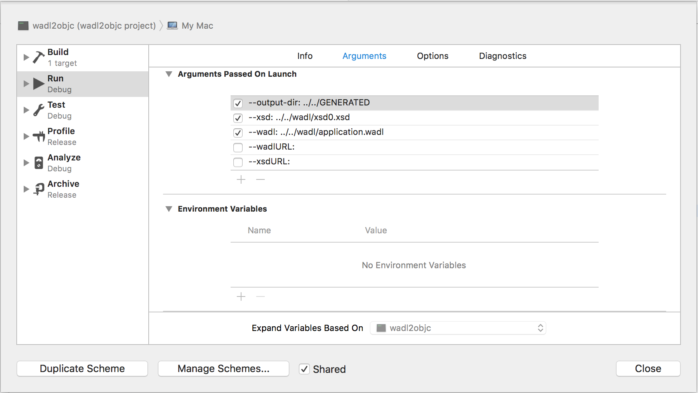

wadl2objc
=========

This is console tool for generating Objective-C code based on WADL and XSD protocols files
[About WADL](https://en.wikipedia.org/wiki/Web_Application_Description_Language)

## Install 

#### Build
To build and run the project you need: 
1. Clone the project `git clone https://github.com/dzhurov/wadl2objc`
2. Prepare your .wadl and .xsd files
3. In the schema settings set related path to .wadl and .xsd files 


#### Use binary 
To use ready build you need copy [Build Folder](wadl2objc/BUILD/Release/) whenever you whant. There are no gem or any package management, so I'd advice you to add wadl2objc folder insied your target project folder to make it available to all contributors of your project. Also it would be nice to add some generateObjCSources.sh file somwhere in repo. Up to you.

## Usage 
First of all you need to provide output dir path using parameter: `--output-dir:`.
There are two options to provide .wadl and .xsd files

#### Use local files
In this case use two parameters `--xsd:` and `--wadl:` with related paths to .wadl and .xsd files.

#### Use remote files
In this case use parameters: `--wadlURL:` and `--xsdURL:` with URLs to needed files. 

## What you get
#### Base classes:
- [`XSDBaseEntity`](wadl2objc/wadl2objc/Resources/XSDBaseEntity.h) class. Is a _Base Entity_ class wich has implemented:
  - NSCopying protocol for all inheritors including copying of _machine classes_ properties
  - Mapping from/to `NSDictionary` and `NSArray<NSDictionary*>`
  - Default `NSDateFormatter`s for xs:date and xs:dateTime
  - [Setting](wadl2objc/wadl2objc/Resources/XSDBaseEntity.h#L77) `NSDictionary` without loosing existing _human class_ data
- [`WADLAbstractServerAPI`](wadl2objc/wadl2objc/Resources/WADLAbstractServerAPI.h) __abstract__ singleton class. 
  - This class will handle all generated services. You'll be able to access services as static methods, like this: `[MyServerAPI.someService doSomethingWithCompletion:...]`
  - And that is it. This class has has minimum implementation. And requires implementation in child class. Main requirement for inheritor is confirmation of protocol [WADLServerAPIInheritor](wadl2objc/wadl2objc/Resources/WADLAbstractServerAPI.h#20) and implementation of `-makeRequest:resource:forURLPath:queryParameters:bodyObject:HTTPHeaderParameters:outputClass:responseBlock:` method, wich should do a real work. It gives you freedom to implement server interaction using any instruments you'd like (AFNetworking, NSURLSession, etc.)
- [`WADLServicesResource`](wadl2objc/wadl2objc/Resources/WADLServicesResource.h) base class for service containder.
- [`WADLRequestTask`](wadl2objc/wadl2objc/Resources/WADLRequestTask.h) defines macro `WADLRequestTask` wich is associates with request operation. By default is `NSURLSessionTask*`. It has flexibility to change on any class (RACSignal, AFHTTPRequestOperation, etc.)
- [`XSDTypes`](wadl2objc/wadl2objc/Resources/XSDTypes.h) — there are two fake classes to determine different xsd types: xs:date and xs:dateTime

#### What will be generated:
- All _Data Transfer Objects_. Every entity implemented by two classes _Human_ and _Machine_ classes. Inspired by [mogenerator](https://github.com/rentzsch/mogenerator)
  - _Human_ class inherits from Machine class, generates only once and never overrides. It's a best place for custom logic and handling setters. 
  - _Machine_ class inherits from `XSDBaseEntity` or another Dtat Transfer Object if hierarchy described in XSD file. It's name has "\_" prefix. It has list of properties reflects fields from xsd object. Also will be generated implementations of methods: `+mappedKeys`, `+enumNameForMappedField:`, `+classNameOfMembersForMappedField:`
- _Services_ classes — `WADLServicesResource` inheritor. It contains a number of requests joined by first url path. For instance we have four requests: 
  - `/auth`
  - `/auth/manager`
  - `/customer`
  - `/customer/search`
for those requests will be generated two _Services_:
  - `WADLAuthService`
  - `WADLCustomerService`
You can access them by your `WADLAbstractServerAPI` inheritor: `[MyServerAPI.auth authenticateUser:user withResponseBlock:^(AuthUserDto *response, NSError *error) {}]`
- _Enums_. You will get all enums declared in .xsd file in Objective-C style. All enums located in [`XSDEnums.h`](wadl2objc/wadl2objc/Resources/XSDEnums_h. It also contains two static methods for mapping server enums to client ObjC scalar values and reverse: `+enumValueForObject:enumName:`, `+objectForEnumValue:enumName:`.
- [`APIConsts`](wadl2objc/wadl2objc/Resources/APIConsts.h) — there are all requests url path templates. E.g.: ```
// Auth
#define kWADLServiceAuthURLPath @"auth"
#define kWADLServiceAuthManagerURLPath @"auth/manager"

// Customer
#define kWADLServiceCustomerURLPath @"customer/%@"
#define kWADLServiceCustomerSearchURLPath @"customer/search"
```
